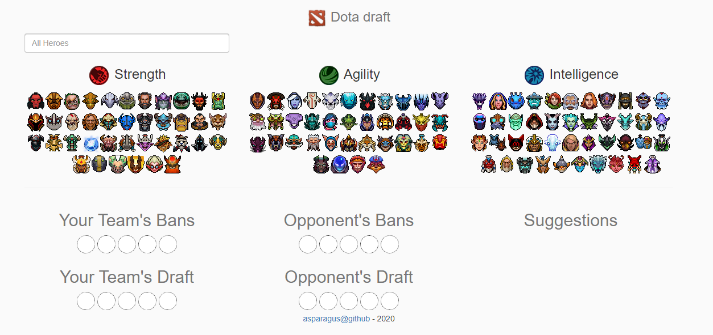

# Dota Draft Web
Published to Google Cloud [here](https://dota-draft-web.uc.r.appspot.com/).

This is the web UI for the [dota-draft](https://github.com/asparagus/dota-draft) ML project.

It is intended to allow selecting the current draft and bans and then automatically get suggestions from the service.

### Assets
Retrieved mini-hero portraits from [devilesk/dota-webassets](https://github.com/devilesk/dota-webassets/tree/master/images/miniheroes), though it seems that [bontscho/dota2-minimap-hero-sprites](https://github.com/bontscho/dota2-minimap-hero-sprites) would have been a better choice.

After retrieving the images, I used [glue](https://glue.readthedocs.io/en/latest/) to convert these into a sprite sheet and then some other tool to keep the transparency.